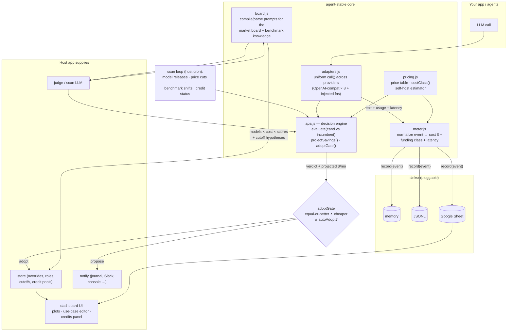

# agent-stable

**Cost-performance management for a stable of AI models.** Meter every call, classify **whose
money it was** (subscription · credits · out-of-pocket), benchmark the market by use case, and
let a procurement agent test new models and adopt cheaper-or-better ones — automatically,
reversibly, and with every decision logged.

Born inside a personal AI chief-of-staff system that runs a dozen agents across three deployment
tiers; extracted module by module so anyone can run it.

## Why

Every multi-agent app quietly accumulates the same questions:

- *What did my agents actually spend this week — and was it real money or a credit pool that
  expires next month?*
- *A new model shipped yesterday. Is it better than what I'm running? Is it cheaper? Who checks?*
- *Which benchmark actually predicts quality for **my** tasks, and what's the minimum score
  that's good enough?*

agent-stable answers these continuously instead of the night you get the invoice.

## The stable

Downstream agents don't ask for model names — they ask for a **tier**, and the stable answers
with the current model, its real cost, and anything time- or token-sensitive:

- **workhorse** — the cheapest adequate model: mechanical extraction, classification, bulk work.
- **steeldust** — your daily driver; the orchestration layer, escalation from workhorse:
  thesis-led summaries, judgment calls, routing decisions.
- **thoroughbred** — a top-tier reasoning model; hard analysis, escalation from steeldust.

```js
const tiers = createTiers({ incumbent: t => store.incumbent(t), priceOf: pricing.priceOf,
  costClass: m => pricing.costClass(m), advisories: (m, t) => myCreditWarnings(m) });
tiers.escalate('workhorse')
// → { tier: 'steeldust', model: 'claude-sonnet-5', price: { in: 3, out: 15 },
//     fundingClass: 'credit', advisories: ['$2/$10 intro pricing through 2026-08-31'] }
```

So a bot can run cheap by default, request escalation when it's out of its depth, and be told
exactly what it will spend — and whose money that is — before it commits.

## How the modules run



Data flow in one sentence: **adapters** make any model callable, the **meter** prices and
funding-classifies every call into a **sink**, the **APA engine** uses the same adapters to
head-to-head-test new models against your incumbent and gates adoption, and the **board**
compiles the market (cost × benchmarks × your thresholds) so the whole loop is inspectable.

## The ideas that matter

1. **Source-of-funds, not just cost.** Every event is classified `real` (out-of-pocket),
   `credit` (finite pools — cloud credits, promo allowances), or `included` (flat-rate
   subscription). A dollar of expiring credit is not a dollar of cash; the procurement agent
   treats expiring credits as near-free when weighing arbitrage.
2. **Use cases own thresholds.** Each tier (workhorse, steeldust, thoroughbred — plus any
   custom roles like "X access") owns a benchmark that predicts quality for it and a minimum
   score. The engine's hypothesis fills the gap until you set one; your manual edits are
   provenance-tracked and never silently overridden.
3. **Reversible autonomy.** Auto-adopt fires only when a candidate is *runnable* (a model that
   can't be probed can never be adopted), *equal-or-better* (judged head-to-head on your task
   suite), and *cheaper*. Every adoption logs its rationale and projected monthly saving, and
   reverts in one click.
4. **Stated assumptions.** Hosted open-weight prices name the host. Self-hosting appears as a
   single reference line computed from an editable `watts × tok/s × $/kWh` formula — labeled as
   an electricity-only estimate, never dressed up as per-model truth.

## Quickstart

```js
const { createMeter, createAdapters, createApa, pricing, sinks } = require('agent-stable');

const sink = sinks.memorySink();
const meter = createMeter({ sink, pricing, host: 'my-app' });

const adapters = createAdapters({
  openai: { apiKey: process.env.OPENAI_API_KEY },
  ollama: {},                                        // local, keyless
});

// meter any call
const out = await meter.wrap(
  () => adapters.call({ provider: 'openai', model: 'gpt-5.1', prompt: 'hello' }),
  { module: 'greeter', model: 'gpt-5.1', extract: r => r.usage },
);

// let the engine judge a candidate against your incumbent
const apa = createApa({ adapters, priceOf: pricing.priceOf,
  judge: p => adapters.call({ provider: 'openai', model: 'gpt-5.1', prompt: p }).then(r => r.text),
  usageHistory: async () => sink.query({ type: 'usage' }) });
const verdict = await apa.evaluate({ id: 'candidate', provider: 'ollama' }, { id: 'gpt-5.1', provider: 'openai' });
console.log(apa.adoptGate(verdict, { autoAdopt: true }));
```

Run the no-network demo: `node demo.js`

## Module status

```
pricing.js   ✅ price table (edit for your stack) · costClass() · selfHostPerMTok()
meter.js     ✅ usage/decision events → cost + fundingClass + latency → sink; wrap()
sinks/       ✅ memory · JSONL · Google Sheet (client injected)   ⬜ SQLite · Postgres
adapters.js  ✅ one OpenAI-compat impl covers openai/xai/openrouter/together/fireworks/
                groq/ollama/lmstudio; bespoke providers injected as fns; keys injected
apa.js       ✅ evaluate · projectSavings · adoptGate · considerFinding — the full decision flow
                with Store/Notify injected (store {recordPrice, incumbent, adopt} · notify
                {info, propose} · log): swap a Sheet+journal for a JSON-file+Slack and it
                behaves identically. Scan-prompt ASSEMBLY stays host-side by design — it is
                context-gathering (credit pools, source scoreboard) from host systems.
tiers.js     ✅ tier-addressed resolution: resolve('workhorse') / escalate() → model + real
                cost + funding class + time-sensitive advisories, for downstream agents
board.js     ◐  compile/parse for market board + benchmark knowledge base (persistence host-side)
server.js    ⬜ standalone HTTP surface + starter dashboard (second package)
```

## Design rules

1. **Pure core.** Modules take data in, return data out. No filesystem, network, env, or key
   access — all I/O is injected by the host.
2. **One-way boundary.** Hosts consume agent-stable outputs; agent-stable never imports host code.
3. **Stated assumptions.** Every cost number carries its basis (API list, scraped-with-source,
   hosted-with-host-name, or the editable self-host formula).
4. **Human-sovereign config.** Roles, benchmarks, thresholds, and credit pools are user-editable;
   the learning loop refines them from outcomes but manual edits win.
5. **Reversible autonomy.** Adopt decisions are gated, probe-guarded, logged with projected
   savings, and revertible per module.

## License

MIT
